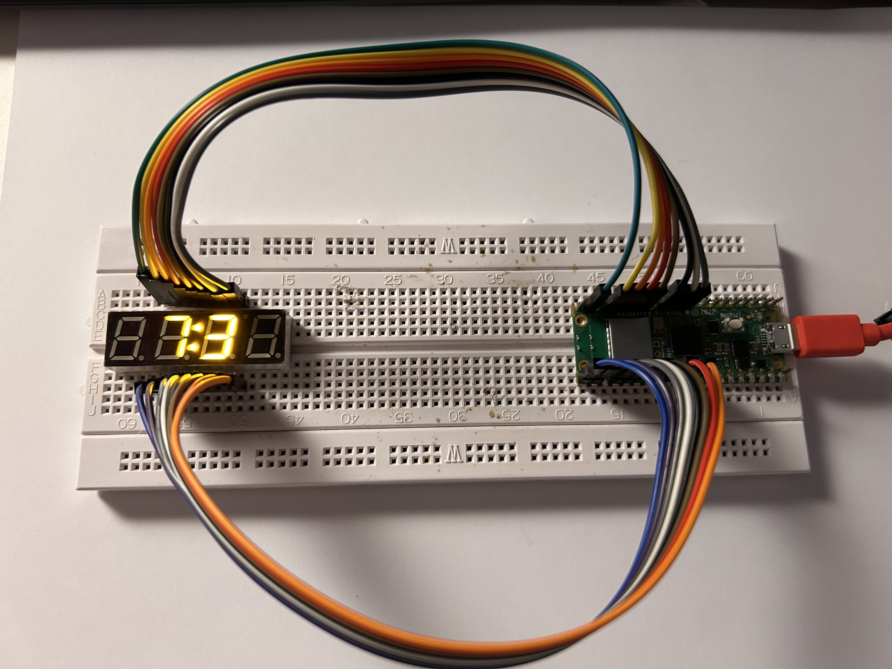

# Raspberry Pi Pico 7-Segment Display Clock

This project displays time and temperature on a YSD-439AY2B-35 4-digit 7-segment display using a Raspberry Pi Pico running MicroPython. The display alternates between showing current time (with colon) and temperature (with degree symbol).

## Features

- WiFi-enabled time synchronization via NTP
- Internal temperature sensor reading
- Alternating display modes (Time/Temperature every 10 seconds)
- Stable colon and degree symbol LEDs
- Flicker-free multiplexed display
- Simple wiring approach connecting top 8 pins to top of Pico, bottom 8 to bottom



## Hardware Requirements

- Raspberry Pi Pico (or Pico W for WiFi)
- YSD-439AY2B-35 4-digit 7-segment display (Common Anode)
- Breadboard
- Jumper wires
- 8x 220Ω resistors (nice to haves, current limiting for segments)
- 4x 1kΩ resistors (nice to haves, current limiting for digits)

## Display Specifications

**Model:** YSD-439AY2B-35 (Common Anode)
**Datasheet:** https://strawberry-linux.com/pub/YSD-439AY2B-35.pdf

### Display Pinout
```
Top View:
[16][15][14][13][12][11][10][09]

[01][02][03][04][05][06][07][08]
```

### Pin Functions
- **Pin 1:** Digit 1 (leftmost)
- **Pin 2:** Digit 2  
- **Pin 3:** Segment D
- **Pin 4:** Colon Anode (+)
- **Pin 5:** Segment E
- **Pin 6:** Digit 3
- **Pin 7:** Segment G
- **Pin 8:** Digit 4 (rightmost)
- **Pin 9:** Degree Cathode (-)
- **Pin 10:** Degree Anode (+)
- **Pin 11:** Segment F
- **Pin 12:** Colon Cathode (-)
- **Pin 13:** Segment C
- **Pin 14:** Segment A
- **Pin 15:** Decimal Point
- **Pin 16:** Segment B

## Wiring Guide

### Raspberry Pi Pico Pinout Used
```
Top Row (GP pins):
GP7  -> Display Pin 9  (Degree Cathode)
GP8  -> Display Pin 10 (Degree Anode)
GP9  -> Display Pin 11 (Segment F)
GP10 -> Display Pin 12 (Colon Cathode)
GP11 -> Display Pin 13 (Segment C)
GP12 -> Display Pin 14 (Segment A)
GP13 -> Display Pin 7  (Segment G)
GP14 -> Display Pin 16 (Segment B)

Bottom Row (GP pins):
GP16 -> Display Pin 1  (Digit 1)
GP17 -> Display Pin 2  (Digit 2)  
GP18 -> Display Pin 3  (Segment D)
GP19 -> Display Pin 4  (Colon Anode)
GP20 -> Display Pin 5  (Segment E)
GP21 -> Display Pin 6  (Digit 3)
GP22 -> Display Pin 15 (Decimal Point)
GP26 -> Display Pin 8  (Digit 4)
```

### Complete Wiring Table
| Pico Pin | GPIO | Function | Display Pin | Resistor |
|----------|------|----------|-------------|----------|
| 10 | GP7 | Degree Cathode | 9 | - |
| 11 | GP8 | Degree Anode | 10 | - |
| 12 | GP9 | Segment F | 11 | 220Ω |
| 14 | GP10 | Colon Cathode | 12 | - |
| 15 | GP11 | Segment C | 13 | 220Ω |
| 16 | GP12 | Segment A | 14 | 220Ω |
| 17 | GP13 | Segment G | 7 | 220Ω |
| 19 | GP14 | Segment B | 16 | 220Ω |
| 21 | GP16 | Digit 1 | 1 | 1kΩ |
| 22 | GP17 | Digit 2 | 2 | 1kΩ |
| 24 | GP18 | Segment D | 3 | 220Ω |
| 25 | GP19 | Colon Anode | 4 | - |
| 26 | GP20 | Segment E | 5 | 220Ω |
| 27 | GP21 | Digit 3 | 6 | 1kΩ |
| 29 | GP22 | Decimal Point | 15 | 220Ω |
| 31 | GP26 | Digit 4 | 8 | 1kΩ |

### Resistor Placement
- **220Ω resistors:** Place between Pico GPIO pins and segment pins (A, B, C, D, E, F, G, DP)
- **1kΩ resistors:** Place between Pico GPIO pins and digit select pins (1, 2, 3, 4)
- **No resistors needed** for colon and degree symbol pins

## Software Setup

### 1. Install MicroPython on Pico
1. Download the latest MicroPython UF2 file for Raspberry Pi Pico
2. Hold BOOTSEL button while connecting Pico to computer
3. Drag the UF2 file to the RPI-RP2 drive
4. Pico will restart with MicroPython

### 2. Create secrets.py
Create a `secrets.py` file with your WiFi credentials:
```python
SSID = "Your_WiFi_Network"
PASSWORD = "Your_WiFi_Password"
```

### 3. Upload Files
Upload both `main.py` and `secrets.py` to the Pico using Thonny IDE or similar.

## Operation

The display operates in two modes that alternate every 10 seconds:

1. **Time Mode:** Shows current time in HH:MM format with colon LED active
2. **Temperature Mode:** Shows temperature in Celsius with degree symbol LED active

### Display Features
- **Multiplexed Display:** Fast switching between digits for flicker-free operation
- **WiFi Sync:** Automatically syncs time via NTP when connected
- **Error Handling:** Shows "Err" if WiFi connection fails
- **Temperature Sensor:** Uses Pico's built-in temperature sensor

## Troubleshooting

### Common Issues
1. **Display not lighting up:** Check power connections and resistor values
2. **Ghosting between digits:** Verify multiplexing timing and clear_digits_and_segments() function
3. **WiFi connection fails:** Check SSID/password in secrets.py
4. **Incorrect segments:** Verify wiring against the pinout table above

### Debug Tips
- Use Thonny's serial monitor to see debug output
- Check that all resistors are properly connected
- Verify display pin connections with multimeter
- Ensure proper common anode wiring (anodes to +, cathodes to -)

## Code Structure

- **Pin Configuration:** All GPIO pins mapped to display functions
- **Segment Patterns:** Character encoding for 7-segment display
- **Multiplexing:** Fast digit switching for persistence of vision
- **Timing Control:** Separate timers for data updates and mode switching
- **WiFi Integration:** NTP time synchronization

## License

This project is open source. Feel free to modify and distribute.
